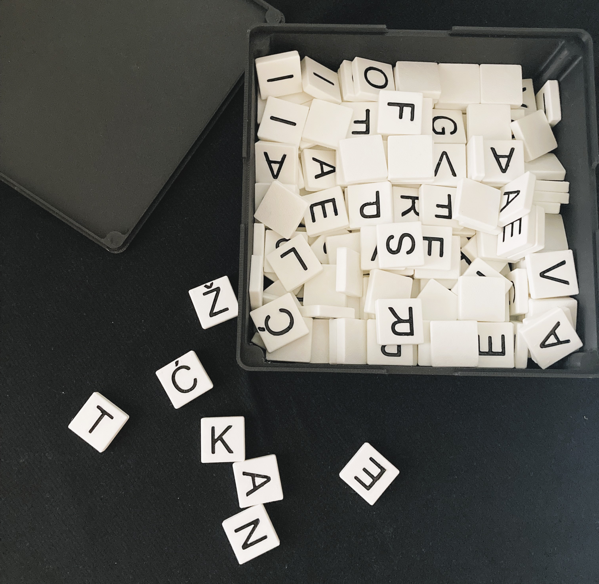

# letter-tiles 🧩
Customizable Croatian and English letter tiles; perfect for creative projects, language learning, or unique design ideas.

  

The files are optimized for 3D printing with PLA filament. The tiles below were printed on a Bambulab A1 mini using default settings. In order to fill in the letter tiles once printed, I recommend using [this method](https://www.youtube.com/watch?v=W2f5lI1R6dg&list=WL&index=63).

## Files Included 📁  
- [individual-tiles](individual-tiles): 3D-printable files (preview available on GitHub [for example](https://github.com/aav31/letter-tiles/blob/main/individual-tiles/letter-tiles%20v41_letter-tiles%20v41_%C5%BD_1_Body1.stl)).
- [letter-tiles_v41.f3d](letter-tiles_v41.f3d): Original Fusion 360 file, complete with parametric design history.
- [letter-tiles_v41.step](letter-tiles_v41.step): Universal CAD file for cross-platform editing.
- [box.stl](box.stl): (Optional) 3D-printable box and lid for the tiles. You should be able to insert 6x2mm Neodymium magnets by setting a pause in the slicer, as [shown here](https://www.youtube.com/watch?v=wJgoH2Or03s&list=WL&index=46).

## Usage Instructions ⚙️  
- **3D Printing Enthusiasts:** Download `.stl` files and use slicer software to prepare for printing. Obviously you will need to replicate some letters in your slicer.
- **Fusion 360 Users:** Download `.f3z` files for full parametric editing.  
- **CAD Professionals:** Download `.step` files to edit the designs in your preferred CAD software.

## License 📄  
This project is licensed under the MIT License. See the [LICENSE](LICENSE) file for details.  

